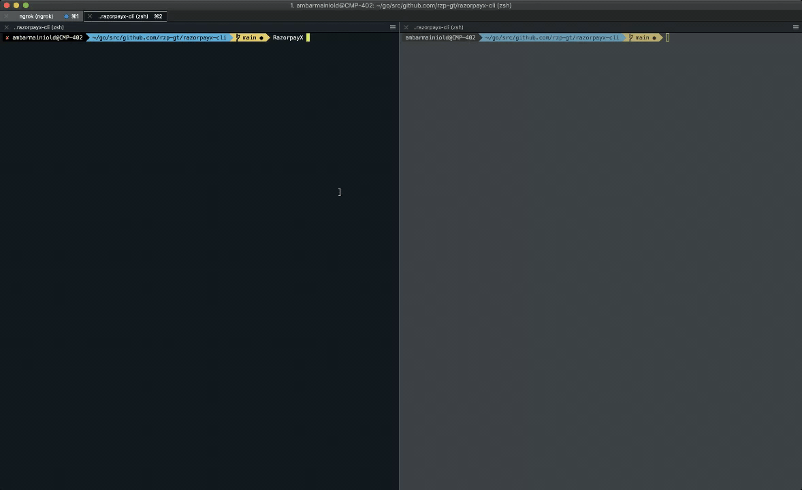

# razorpayx-cli

A devoper friendly command-line tool to help you test an assortment of different APIs and webhooks on RazorpayX.

**Here are the features that we provide in our beta release:**

- Run custom `post` and `get` requests directly from your terminal with the option to change various parameters
- Run fixtures (which are a set of predefined APIs that help you understand the flow)
- Listen to webhooks triggered from the API (with the abilty to trigger webhooks straight from your terminal as well)
- A consolidated list of all documentation needed while onboarding
- A dynamic checklist that updates as you integrate with new APIs

All this to make your API onboarding onto RazorpayX much smoother.



## Installation

To install, firstly clone the repository:

`git clone https://github.com/rzp-gt/razorpayx-cli.git`

Next, we'll build the program using:

`go build -o /usr/local/bin/RazorpayX cmd/razorpayx/main.go`

## Running the commands

After the installation you shall have access to the `RazorpayX` command

```
RazorpayX [command]

# Use `--help` for details about RazopayX CLI commands
RazorpayX [command] --help
```

## Commands we support

### config

config is used for the initial setup of your RazorpayX CLI only after which you'll be able to make successful calls to the Razorpay servers. config lets you set and unset specific configuration values or your profile if you need more granular control over the configuration.

### fixtures

Fixtures are a set of predefined APIs that are fired from the CLI to RazorpayX. This ends up creating certain entities in a logical format and hence fixtures can be used to test entire flows and to understand the request/response structures as well.

### get

Get allows you to make `http get` calls to RazorpayX directly from the CLI. 

### post

Post allows you to make `http post` calls to RazorpayX directly from the CLI. The post command even supports features like idempotency key.

### wiki

Wiki guides you towards the API documentation of RazorpayX and towards the documentation of each and every feature.

To see a list of all the wikis, use :

`RazorpayX wiki --list`

### listen

The listen command watches webhook events from RazorpayX API to your local machine by connecting directly to RazorpayX's API. Any events triggered from the dashboard as well as events triggered via the CLI will appear here.

### trigger

Trigger helps you to trigger certain predefined actions via your CLI. These actions then trigger the corresponding webhook events. The trigger command will also create all necessary side-effect events that are needed to create the triggered event as well as the corresponding API objects.

As an example:
 
`RazorpayX trigger checklist.get` 

can be used to fetch the current API integration checklist status.
